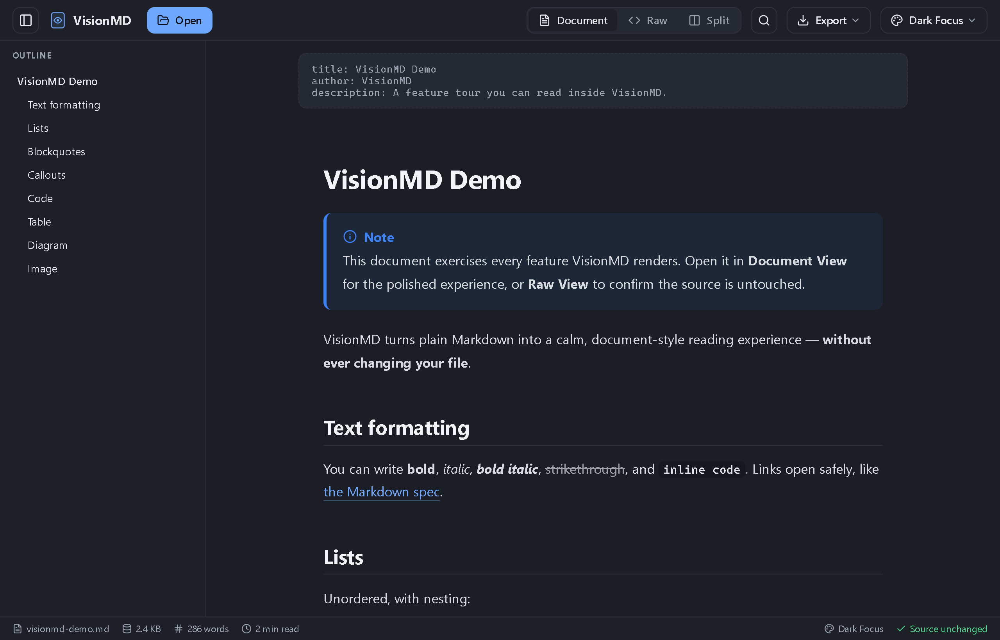
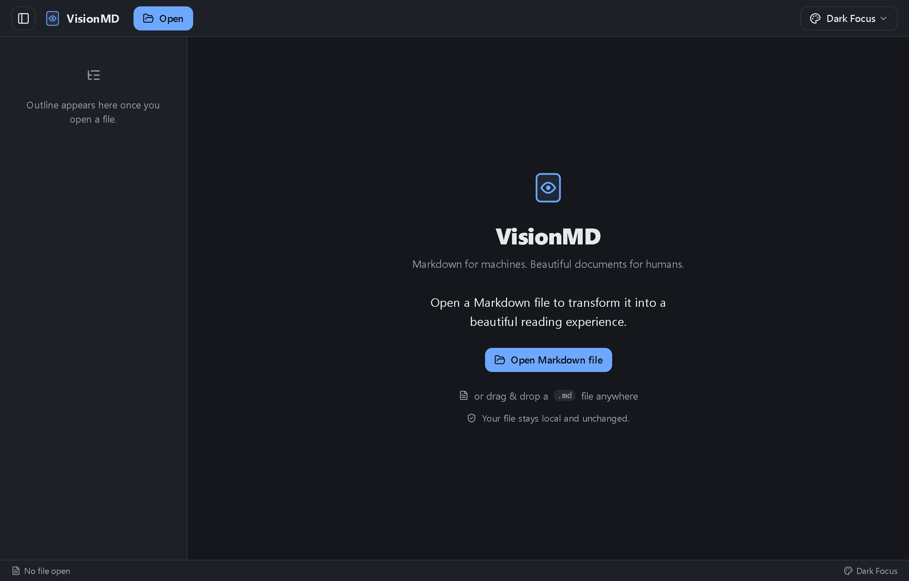
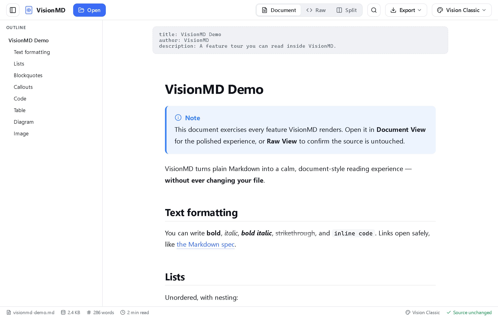
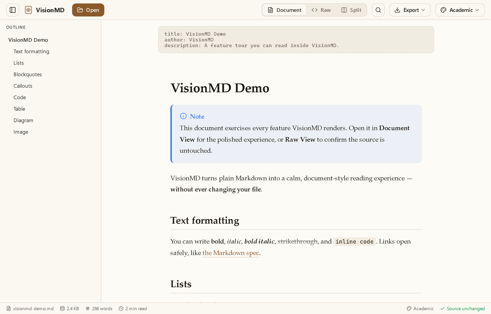
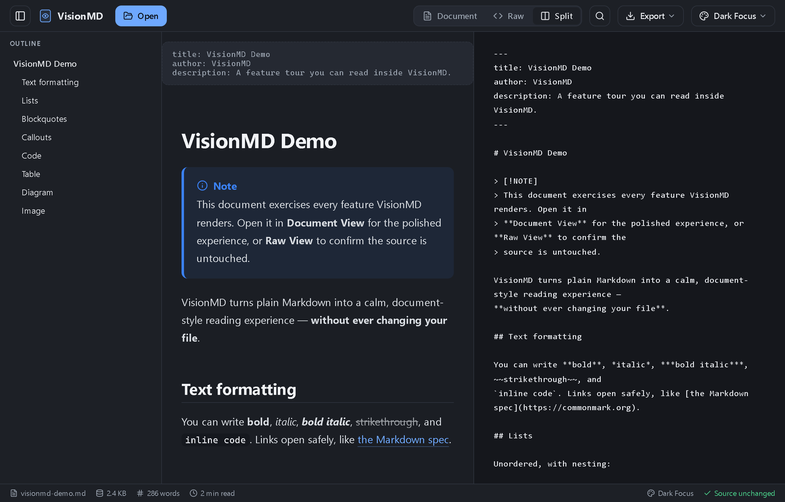
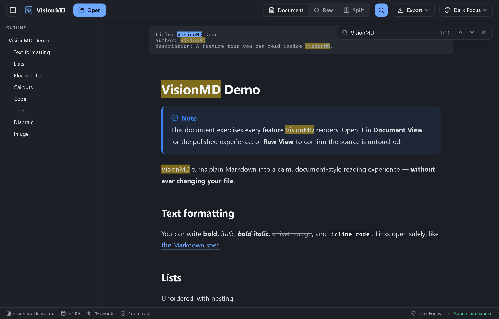
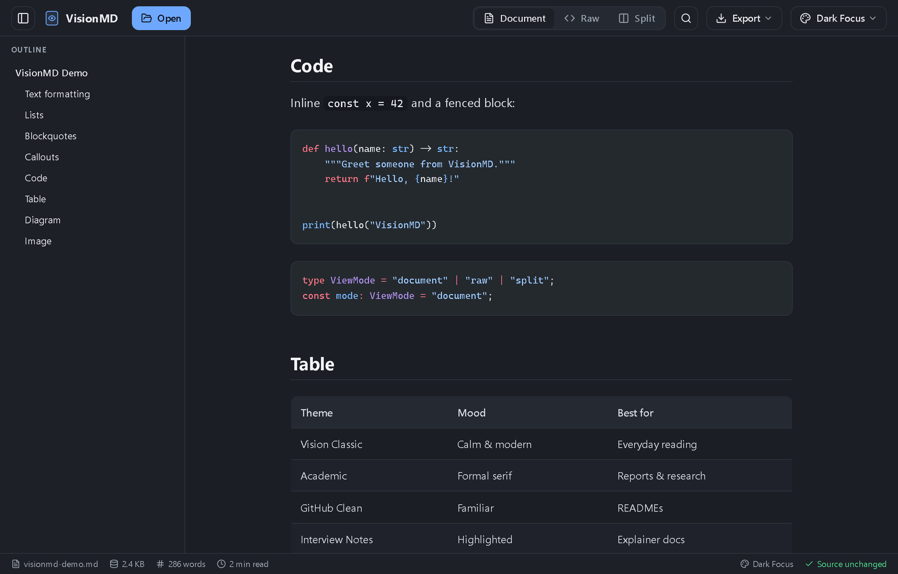

<div align="center">

# 👁️ VisionMD

### Markdown for machines. Beautiful documents for humans.

VisionMD is a fast, private, **read-only Markdown viewer** that turns plain `.md`
files into calm, polished, document-style reading — **without ever changing your file.**

[](https://tauri.app)
[](https://react.dev)
[](https://www.typescriptlang.org)
[](https://vitejs.dev)
[](LICENSE)



</div>

---

## What is VisionMD?

Markdown is great to *write*, but raw `.md` files are not pleasant to *read* — and
most editors show you a cramped, editor-flavoured preview. VisionMD is the opposite:
a dedicated **viewer** whose only job is to make a Markdown file look like a finished
document.

You point it at a file and get a clean reading layout with a navigable outline,
syntax-highlighted code, rendered diagrams, callouts, full-document search, multiple
themes, and one-click export to PDF or HTML. Your original file is **never modified** —
VisionMD only ever reads it.

It runs as a lightweight native desktop app (via [Tauri](https://tauri.app)) and the
exact same UI also runs in any browser during development.

### Why you might want it

- 📖 **Read, don't edit.** A distraction-free reading surface for notes, READMEs,
  research, and lecture notes.
- 🔒 **Completely private.** No network, no telemetry, no accounts. Files stay on your
  machine and are opened read-only.
- 🎨 **Looks the way you want.** Five hand-tuned themes, from a calm light default to a
  low-glare dark mode and a formal academic serif.
- 🪶 **Tiny and fast.** A Tauri shell (system WebView, no bundled Chromium) means a small
  binary and quick startup.

---

## ✨ Features

| | Feature | Details |
|---|---|---|
| 📄 | **Document / Raw / Split views** | Read the polished render, inspect the untouched source, or see both side-by-side. |
| 🎨 | **5 themes** | Vision Classic, Academic, GitHub Clean, Interview Notes, and Dark Focus (default). Switch instantly; your choice is remembered. |
| 🧭 | **Outline sidebar** | Auto-generated from headings — click to jump to any section. |
| 🔍 | **In-document search** | `Ctrl/Cmd+F` highlights every match with next/previous navigation and a live count. |
| 🌈 | **Syntax highlighting** | Powered by [Shiki](https://shiki.style) with light/dark token sets that follow your theme. |
| 📊 | **Mermaid diagrams** | Flowcharts and diagrams render live and re-theme with the app. |
| 💬 | **GitHub callouts** | `> [!NOTE]`, `[!TIP]`, `[!IMPORTANT]`, `[!WARNING]`, `[!CAUTION]` render as styled admonitions. |
| 📑 | **GFM support** | Tables, task lists, strikethrough, autolinks, and frontmatter. |
| 🖨️ | **Export** | Save a faithful, self-contained **HTML** file or **Print → Save as PDF**, with all styling and diagrams baked in. |
| 🕘 | **Recent files** | Quick access to recently opened documents (native app). |
| 📊 | **Reading stats** | Word count, file size, and estimated reading time in the status bar. |
| 🛡️ | **Safe by design** | Rendered HTML is sanitized, scripts are never executed, and external links open with `noopener`. |
| 🖱️ | **Drag & drop** | Drop a `.md` file anywhere in the window to open it. |

---

## 📸 Screenshots

<table>
  <tr>
    <td width="50%"><strong>Welcome / empty state</strong><br/></td>
    <td width="50%"><strong>Document view — Dark Focus</strong><br/></td>
  </tr>
  <tr>
    <td width="50%"><strong>Document view — Vision Classic (light)</strong><br/></td>
    <td width="50%"><strong>Academic theme</strong><br/></td>
  </tr>
  <tr>
    <td width="50%"><strong>Split view (render + source)</strong><br/></td>
    <td width="50%"><strong>Find in document</strong><br/></td>
  </tr>
  <tr>
    <td colspan="2"><strong>Syntax highlighting &amp; tables</strong><br/></td>
  </tr>
</table>

---

## 🚀 Getting started

### Prerequisites

- **[Node.js](https://nodejs.org) 18+** and **npm** (for the web UI).
- To build the **native desktop app**, you also need the
  [Tauri 2 prerequisites](https://v2.tauri.app/start/prerequisites/) for your OS:
  - **Windows:** Microsoft Visual Studio C++ Build Tools + WebView2 (preinstalled on Windows 11).
  - **macOS:** Xcode Command Line Tools.
  - **Linux:** `webkit2gtk` and related packages.
  - **Rust** (stable) via [rustup](https://rustup.rs) on all platforms.

### Install

```bash
git clone https://github.com/JoelAlfred1997/VisionMD.git
cd VisionMD
npm install
```

### Run in the browser (fastest)

The entire UI runs in a normal browser — handy for development and a quick look.

```bash
npm run dev
```

Then open **http://localhost:1420** and drag a `.md` file onto the window.

> In the browser, the native **Open** dialog and **Recent files** reopening aren't
> available (they need the desktop shell), but drag-and-drop works and everything else
> renders identically.

### Run as the native desktop app

```bash
npm run tauri dev
```

This launches the real VisionMD window with full file-system access (native Open
dialog, recent-file reopening, etc.).

### Build a release binary

```bash
npm run tauri build
```

The installer/executable is written to `src-tauri/target/release/bundle/`.

---

## 📖 User guide

### 1. Opening a document

There are three ways to open a Markdown file:

- **Drag & drop** — drop a `.md` file anywhere on the window.
- **Open button** — click **Open** in the toolbar (native app) to pick a file.
- **Recent files** — click the 🕘 clock menu in the toolbar, or pick from the welcome
  screen, to reopen a recent document (native app).

Supported extensions: `.md`, `.markdown`, `.mdown`, `.mkd`.

> 🔒 VisionMD opens files **read-only**. It never writes back to your `.md`, and the
> status bar always shows **“Source unchanged.”**

### 2. View modes

When a document is open, a segmented control appears in the toolbar:

| Mode | What it shows |
|------|----------------|
| **Document** | The fully rendered, styled reading view. |
| **Raw** | The exact, untouched Markdown source. |
| **Split** | Rendered view and source side-by-side. |

Your last-used view mode is remembered between sessions.

### 3. The outline

The left sidebar shows an **outline** built from the document's headings. Click any
entry to smoothly scroll to that section. Toggle the sidebar with the panel button in
the top-left of the toolbar.

### 4. Searching

Press **`Ctrl+F`** (or **`Cmd+F`** on macOS), or click the 🔍 search button, to open the
find bar. As you type, every match is highlighted and the active match is emphasised.

- **Enter** / **↓** — next match
- **Shift+Enter** / **↑** — previous match
- **Esc** — close the find bar

Search works in whichever view is active (Document, Raw, or Split) and the counter shows
your position, e.g. `3 / 11`.

### 5. Themes

Click the 🎨 palette menu in the toolbar to switch themes. Your choice is saved and
re-applied on next launch (with no flash of the wrong theme on startup).

| Theme | Mood | Best for |
|-------|------|----------|
| **Vision Classic** | Calm & modern | Everyday reading |
| **Academic** | Formal serif | Reports & research |
| **GitHub Clean** | Familiar | READMEs |
| **Interview Notes** | Highlighted sections | Explainer docs |
| **Dark Focus** *(default)* | Low-glare dark | Night reading |

### 6. Exporting

Click the ⬇️ **Export** menu in the toolbar:

- **Save as HTML** — downloads a single, self-contained `.html` file. All styles, syntax
  highlighting, and Mermaid diagrams are inlined, so it looks identical and works offline
  with no external assets.
- **Print · Save as PDF** — opens your system print dialog; choose “Save as PDF” to get a
  clean, app-chrome-free PDF.

Exports always reflect the **full document** in the current theme, regardless of which
view mode you're in.

### 7. Reading stats

The status bar along the bottom shows the file name, file size, **word count**, and an
estimated **reading time** (~200 words/minute), plus the active theme.

### ⌨️ Keyboard shortcuts

| Shortcut | Action |
|----------|--------|
| `Ctrl/Cmd + F` | Open the find bar |
| `Enter` / `↓` | Next search match |
| `Shift+Enter` / `↑` | Previous search match |
| `Esc` | Close the find bar |

---

## 🧱 Tech stack & architecture

- **[Tauri 2](https://tauri.app)** — native desktop shell using the system WebView (no
  bundled browser → small binary). The Rust side exposes a single, hardened
  `read_text_file` command that validates the extension, caps file size, and never logs
  file contents.
- **[React 19](https://react.dev) + [TypeScript](https://www.typescriptlang.org)** — UI.
- **[Vite 7](https://vitejs.dev)** — dev server & bundler (dev URL `http://localhost:1420`).
- **[react-markdown](https://github.com/remarkjs/react-markdown)** with `remark-gfm`,
  `remark-frontmatter`, and a rehype pipeline (`raw → sanitize → slug → autolink`) so
  trusted heading anchors survive sanitization while untrusted HTML is neutralised.
- **[Shiki](https://shiki.style)** — syntax highlighting with dual light/dark themes
  driven by CSS variables.
- **[Mermaid](https://mermaid.js.org)** — diagrams, re-rendered on theme change with
  `securityLevel: "strict"`.
- **[Vitest](https://vitest.dev)** + Testing Library — unit tests.

**Conventions:** styling uses CSS Modules per component and CSS-variable design tokens
(no hardcoded colours); themes are applied via `<html data-theme="…">`; file access is
centralised in a service that runtime-detects Tauri vs. browser; core Markdown/file logic
is framework-agnostic and unit-tested.

### Project structure

```
visionmd/
├─ src/
│  ├─ App.tsx                 # State container + file-load orchestration
│  ├─ components/             # AppShell, Toolbar, Sidebar, StatusBar, SearchBar, menus…
│  ├─ features/
│  │  ├─ files/               # fileService (Tauri/browser), drag-drop, recent files
│  │  ├─ markdown/            # renderer, outline + reading-stats logic
│  │  ├─ search/              # CSS Custom Highlight API search hook
│  │  ├─ theme/               # theme registry
│  │  ├─ export/              # HTML/PDF export builder
│  │  └─ preferences/         # localStorage-backed persistence
│  ├─ styles/                 # global tokens, themes, markdown, export CSS
│  └─ types/                  # shared types
├─ src-tauri/                 # Rust shell (read_text_file command, capabilities)
├─ sample-docs/               # visionmd-demo.md feature-tour document
├─ docs/                      # progress notes + screenshots
└─ public/
```

---

## 🧪 Development

```bash
npm run dev          # Vite dev server (browser) at http://localhost:1420
npm run tauri dev    # Native desktop app (hot-reloads the same UI)
npm run build        # Type-check (tsc) + production web build
npm test             # Run the Vitest unit suite once
npm run test:watch   # Vitest in watch mode
npm run tauri build  # Build a native release bundle
```

There's a feature-tour document at [`sample-docs/visionmd-demo.md`](sample-docs/visionmd-demo.md)
that exercises every renderer feature — drop it into the app to see everything at once.

---

## 🔐 Privacy & security

VisionMD is built to be safe with files you didn't write:

- **No network & no telemetry.** Nothing is uploaded, tracked, or phoned home.
- **Read-only.** Your `.md` file is never modified.
- **Sanitized rendering.** Embedded HTML is sanitized; `<script>`, inline event handlers,
  and `javascript:` URLs are stripped and never executed.
- **Safe links.** External links open with `target="_blank"` + `rel="noopener noreferrer"`.
- **Hardened file reads.** The native file command validates the extension, enforces a
  size cap, and never logs file contents.

---

## 📄 License

Released under the [MIT License](LICENSE).

---

<div align="center">
<sub>Built with Tauri, React, and TypeScript.</sub>
</div>
