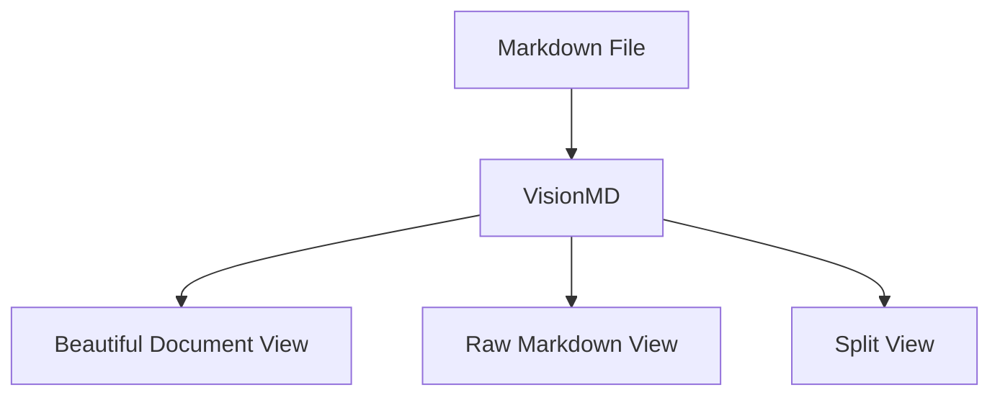

# VisionMD Demo

> [!NOTE]
> This document exercises every feature VisionMD renders. Open it in
> **Document View** for the polished experience, or **Raw View** to confirm the
> source is untouched.

VisionMD turns plain Markdown into a calm, document-style reading experience —
**without ever changing your file**.

## Text formatting

You can write **bold**, *italic*, ***bold italic***, ~~strikethrough~~, and
`inline code`. Links open safely, like [the Markdown spec](https://commonmark.org).

## Lists

Unordered, with nesting:

- Writers who want their notes to look finished
- Developers reviewing READMEs
  - Nested point one
  - Nested point two
    - Even deeper
- Students reading lecture notes

Ordered:

1. Open a file
2. Pick a theme
3. Read comfortably

Task list:

- [x] Open a Markdown file
- [x] Render it beautifully
- [ ] Export to PDF

## Blockquotes

> Markdown is for machines. VisionMD makes it for humans too.

## Callouts

> [!TIP]
> Use the outline in the sidebar to jump between sections.

> [!WARNING]
> VisionMD is a viewer — it never writes back to your file.

> [!IMPORTANT]
> Your file stays local. Nothing is uploaded.

> [!CAUTION]
> Embedded scripts in Markdown are sanitized and never executed.

## Code

Inline `const x = 42` and a fenced block:

```python
def hello(name: str) -> str:
    """Greet someone from VisionMD."""
    return f"Hello, {name}!"


print(hello("VisionMD"))
```

```ts
type ViewMode = "document" | "raw" | "split";
const mode: ViewMode = "document";
```

## Table

| Theme            | Mood              | Best for            |
| ---------------- | ----------------- | ------------------- |
| Vision Classic   | Calm & modern     | Everyday reading    |
| Academic         | Formal serif      | Reports & research  |
| GitHub Clean     | Familiar          | READMEs             |
| Interview Notes  | Highlighted       | Explainer docs      |
| Dark Focus       | Low-glare         | Night reading       |

## Diagram



## Image


---

That's the tour. Switch themes from the toolbar to see the document restyle
instantly.
